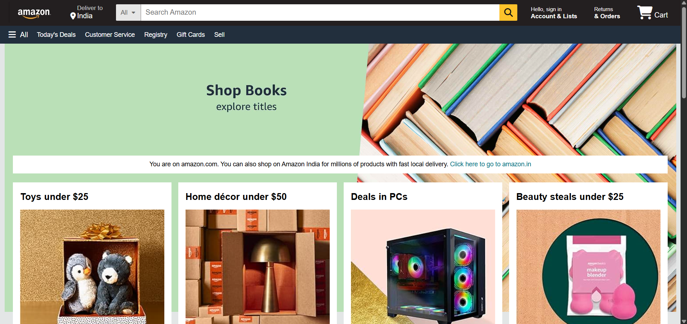
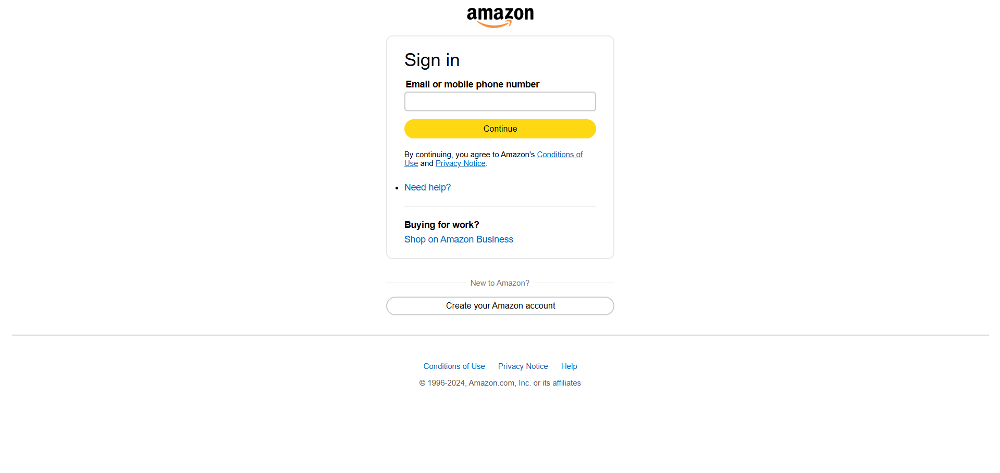

# 🛍️ Amazon Clone Website

A **fully responsive clone of the Amazon homepage**, built using **HTML** and **CSS**.  
The goal of this project was to **replicate the design, layout, and responsiveness** of the real Amazon website — including the **header, navigation bar, search bar, hero section, product listings, and footer**.  

This project showcases attention to detail, responsive design skills, and creative use of **CSS animations and layouts**. 🎯  

---

## 📸 Screenshots

| Preview 1 | Preview 2 |
|------------|------------|
|  |  |

| Preview 3 | Preview 4 |
|------------|------------|
|  |  |

---

## 🌟 Project Overview

### 🧱 Technologies Used
- 🖥️ **HTML5** – For structuring the website.  
- 🎨 **CSS3** – For styling, layout, and responsiveness.  
- 🌟 **Font Awesome** – For adding icons to enhance the UI.  

---

### ✨ Key Features
- 📱 **Fully Responsive Design:** Adapts perfectly to desktop, tablet, and mobile screens.  
- 🧭 **Modern Header:** Includes the Amazon logo, navigation bar, search box, account options, and cart icon.  
- 🖼️ **Hero Section:** Features a large promotional banner with localized content and call-to-action messages.  
- 📦 **Product Showcase:** Displays multiple product boxes with titles, images, and “Shop Now” links.  
- 📑 **Comprehensive Footer:** Multi-column layout with links similar to Amazon’s original design.  
- 🎞️ **Smooth Animations:** Subtle hover and transition effects using CSS for better interactivity.  

---

## 🚀 How to Run the Project
1. Clone the repository:
   
   ```bash
   git clone https://github.com/TonyStark-19/Amazon-webiste-clone.git
   ```
3. Navigate to the project folder:
   
   ```bash
   cd Amazon-webiste-clone
   ```
5. Open the `index.html` file in your browser.

---

## 🌟 Acknowledgments

- 🛍️ [Amazon](https://www.amazon.com/) for design inspiration.
- 💡 Inspired by modern web design and responsive development practices.

---

⭐ If you like this project, don’t forget to star the repository!
